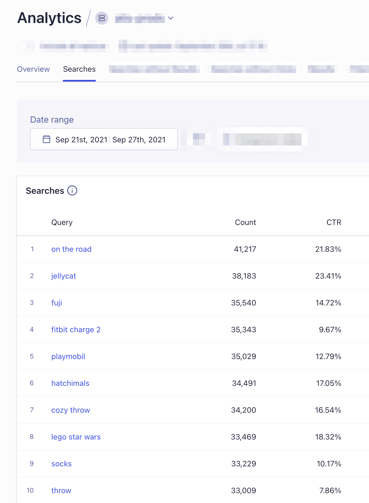
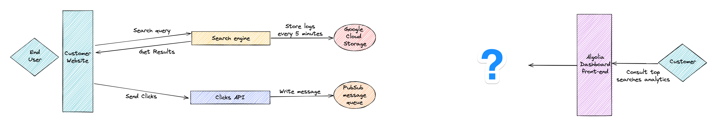

# Technical test

The goal of this test is to evaluate your ability to parse and process a large amount of data and to use the appropriate data structures to solve a challenge.

The goal is to extract the popular (most frequent) queries done during a specific time range from a given log dataset.

The provided [sample file](https://www.dropbox.com/s/duv704waqjp3tu1/hn_logs.tsv.gz?dl=0) is a TSV file listing all queries performed on [HN Search](https://hn.algolia.com) during a few days.
Each line contains a timestamp and a query separated by a tab.

## Instructions

### Part 1: Code

Build a small application exposing the following endpoint through a REST API:

 * `GET /1/queries/count/<DATE_PREFIX>`: returns a JSON object specifying the number of distinct queries that have been done during a specific time range

#### Examples

 * Distinct queries done in 2015: `GET /1/queries/count/2015`: `{"count": 573697}`
 * Distinct queries done in Aug: `GET /1/queries/count/2015-08`: `{"count": 573697}`
 * Distinct queries done on Aug 3rd: `GET /1/queries/count/2015-08-03`: `{"count": 198117}`
 * Distinct queries done on Aug 1st between 00:04:00 and 00:04:59: `GET /1/queries/count/2015-08-01 00:04`: `{"count": 617}`

#### Guidelines

* You can use third party libraries if you know how to re-implement the features they're providing
* Your application cannot depend on any database or external software (one of the goals being to evaluate your ability to choose the right data structures)
* Provide a solution in one of the following languages: Go, Python
* Don't overthink the assignment. Provide a solution that you would be happy to push to production
* If you have several implementations in mind, pick one and discuss the alternatives in the README of your project

#### Evaluation Criteria

* Please push your code to a GitHub repository or send us an archive
* Include a Readme helping us run your service
* Include a section about your thought process explaining your choices and share other alternative designs you considered
* Add any information you deem interesting for us to better understand your assignment

We'll evaluate:
 
 * The complexity & scalability of your algorithm
 * The readability of your code (including readability of your tests)
 * The correctness of the outputs of the API
 * You're ability to share your design choices and clearly weight pros & cons of alternative solutions
 * The overall quality of your written technical communication

### Part 2: System design

Describe briefly how you would build at scale and in the cloud (preferably with GCP) an API to power a simplified page of our Search Analytics:

For a given timerange, you must be able to return:
* The top 1000 top popular searches
* Their count
* Their CTR (Click through rate)

The new service(s) must fit in the following architecture:

Some additional information:
* The traffic expected is up to 100K searches and 10K click events per day per customer application
* Each click is tied to a specific search in the log with a `queryID`
* Click events events are accepted by the API if they are reiceved up to 15 minutes after the search
* Customer may request up to 3 month of timerange in the Analytics

Describe the eventual databases that you would setup and their content, the eventual packaged services you would use, and the different processes you would create. For each logical brick, explain their goal and how do they communicate together.

#### Evaluation Criteria

* Please push it along with your code on GitHub repository or in the archive
* Stay concise (maximum 1 page)
* Include at least a schema with a global overview of your architecture

We'll evaluate:

 * The complexity & scalability of your architecture
 * The readability of your document
 * The document will be used as a base for our discussion during the assignment review where we'll ask follow-up question

If you have any question, please out to the recruiter you are in touch with. For the evaluation, we do not take into account the fact that you did or did not ask a question.

Good luck!
